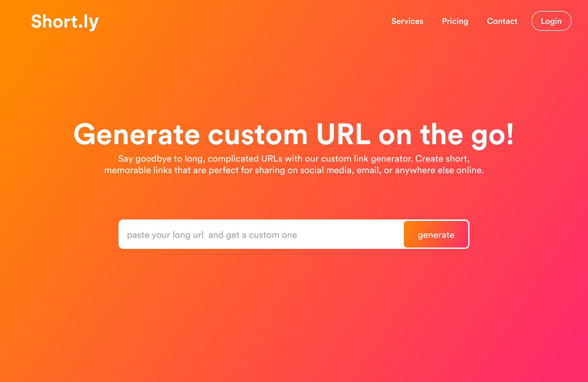

# Short.ly

## Demo


## Description

This is a full-stack URL shortener web application built with Node.js, Express, MongoDB, and TypeScript. It allows users to create shortened versions of long URLs and track click analytics. Users can also customize the slug in the shortened URL and create an account to manage their URLs.

## Features

- Shorten long URLs with customizable slugs
- Track click analytics for shortened URLs
- User authentication and URL management
- Password hashing for security
- Rate limiting to prevent abuse
- Custom error pages


### Backend file structure

```
📁 server/
├── 📁 src/
│   ├── 📁 config/
│   │   └── 📄 db.ts
│   ├── 📁 controllers/
│   │   ├── 📄 urlController.ts
│   │   └── 📄 userController.ts
│   │   └── 📄 qrcodeController.ts
│   ├── 📁 interface/
│   │   └── 📄 interface.ts
│   ├── 📁 middleware/
│   │   ├── 📄 auth.ts
│   │   └── 📄 download.ts
│   ├── 📁 models/
│   │   ├── 📄 url.ts
│   │   └── 📄 user.ts
│   │   └── 📄 qrcode.ts
│   ├── 📁 routes/
│   │   ├── 📄 url.ts
│   │   └── 📄 user.ts
│   │   └── 📄 qrcode.ts
│   ├── 📁 services/
│   │   └── 📄 userService.ts
│   │   └── 📄 qrcodeService.ts
│   ├── 📁 utils/
│   │   ├── 📄 logger.ts
│   │   └── 📄errorHandlers.ts  
│   ├── 📁 test/
│   │   ├── 📄 urlTest.test.ts
│   │   └── ... 
│   └── 📄 index.ts.ts
├── 📄 .env
├── 📄 package.json
└── 📄 tsconfig.json


```
<!-- ## Demo

<div align="center">  

</div> -->

## Installation

1. Clone this repository.
2. Run `npm install` to install dependencies.
3. Set up your MongoDB database and update the `MONGODB_URI` environment variable in `.env`.
4. Run `npm run dev` to start the development server.

## Usage

To create a shortened URL, simply enter a long URL into the input field on the homepage and click "Shorten". You can also optionally enter a custom slug to use for the shortened URL.

To view analytics for a shortened URL, navigate to the URL details page by clicking on the shortened URL in the user dashboard. Here you can see the number of clicks and other metrics for the URL, as well as generate a QR code for it.

To manage your URLs and view analytics, log in to your account and navigate to the user dashboard. Here you can view all your shortened URLs, search and filter them, and view detailed analytics for each one.


## Acknowledgements

This project was inspired by Bitly and built with the help of the following libraries and tools:

- Node.js
- Express
- MongoDB
- Mongoose
- TypeScript
- Passport.js
- Chart.js
- qrcode
- dotenv
- Jest
- ESLint
- Prettier

## License

[MIT](./LICENSE)

# Author

[Abubakar Balogun](https://github.com/abubalo)
